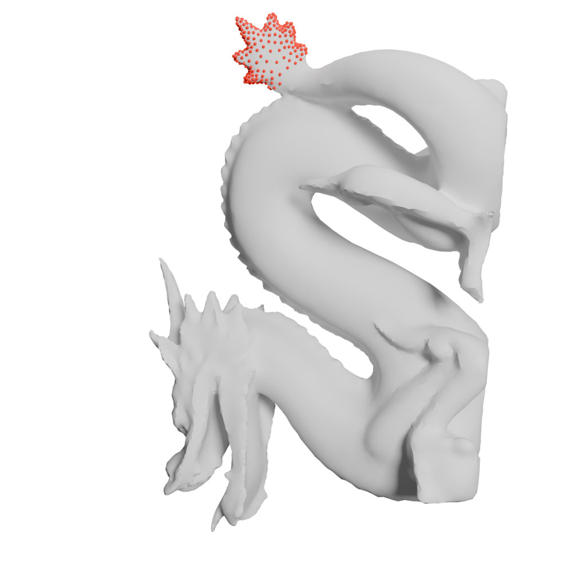
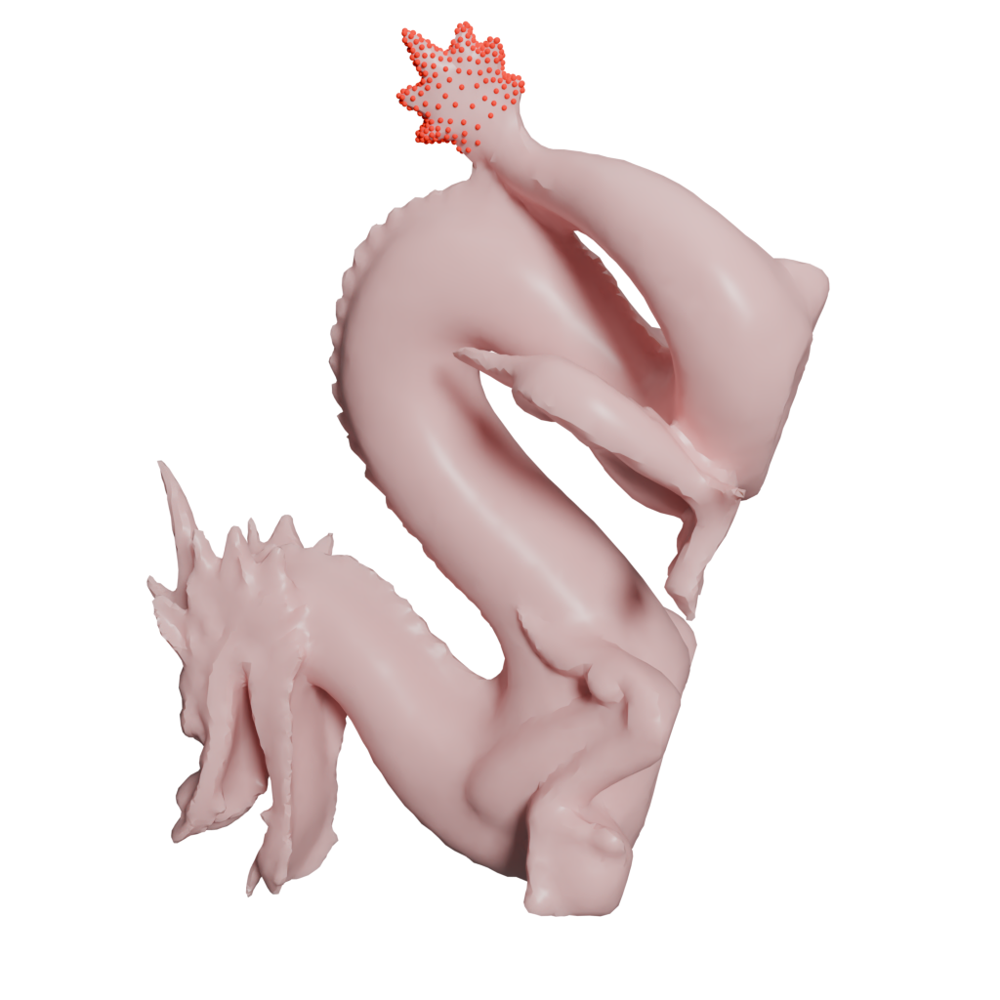

# libpgo

## Library for Physically based Simulation (P), Geometric Shape Modeling (G), and Optimization (O)

The library is designed to primarily focus on physically based simulations, geometric shape modeling, and optimization.
The source code extends [VegaFEM](https://viterbi-web.usc.edu/~jbarbic/vega/) and is designed for academic research purposes.

Release information:

- [Release notes](release-notes.txt)

---

## Install a prebuilt wheel

Release 0.0.4 is distributed as standalone CPython 3.12 wheels through the
recorded [GitHub Actions artifacts](https://github.com/annajcy/libpgo/actions).

| Platform | Supported target | Artifact name |
| --- | --- | --- |
| Linux | `manylinux_2_28`, x86-64 | `pypgo-0.0.4-manylinux_2_28-x86_64` |
| macOS | macOS 26+, arm64 | `pypgo-0.0.4-macos-arm64` |
| Windows | Windows x86-64 | `pypgo-0.0.4-windows-x86_64` |

Download the artifact for the release commit. A prebuilt wheel does not
require Conda or a system installation of MKL, TBB, GMP, or MPFR.
Install [uv](https://docs.astral.sh/uv/getting-started/installation/) first;
`uv venv` downloads Python 3.12 when it is not already available.
`uv pip` and `uv run` automatically use the default `.venv`.

Linux:

```bash
uv venv --python 3.12
uv pip install "numpy==2.0.2"
uv pip install --no-deps \
  /path/to/pypgo-0.0.4-cp312-cp312-manylinux_2_28_x86_64.whl
uv run python -c "import pypgo; print(pypgo)"
```

macOS 26 arm64:

```bash
uv venv --python 3.12
uv pip install "numpy==2.0.2"
uv pip install --no-deps \
  /path/to/pypgo-0.0.4-cp312-cp312-macosx_26_0_arm64.whl
uv run python -c "import pypgo; print(pypgo)"
```

Windows PowerShell:

```powershell
uv venv --python 3.12
uv pip install "numpy==2.0.2"
uv pip install --no-deps `
  C:\path\to\pypgo-0.0.4-cp312-cp312-win_amd64.whl
uv run python -c "import pypgo; print(pypgo)"
```

Linux and Windows wheels bundle oneMKL, the matching oneTBB runtime, GMP, and
MPFR. The macOS wheel bundles oneTBB, GMP, and MPFR and links the system
Accelerate framework. See the
[prebuilt-wheel guide](docs/guide/build/build-from-wheel.md) for artifact
download and checksum commands.

## Build from source

Source builds require CMake 3.29 or newer, a C++20 compiler, Python 3.12, and
network access for pinned FetchContent archives. Unlike a repaired release
wheel, a source installation may depend on native libraries installed on the
build machine.

The repository tracks `.python-version` and a cross-platform `uv.lock`.
`uv sync --locked` installs the common build/test tools plus the current
platform's wheel-repair tool; Linux and Windows additionally receive the
matching Intel MKL/TBB packages through environment markers. It prepares the
environment but intentionally does not compile or install pypgo. The default
developer workflow uses the cross-platform full `base` preset, which includes
the Python extension. The extension can then be imported directly from the build tree through
`PYTHONPATH`, so an incremental C++ rebuild does not require another
`pip install`.

### Linux x86-64

Ubuntu or Debian:

```bash
sudo apt update
sudo apt install -y build-essential git libgmp-dev libmpfr-dev

uv sync --locked

uv run cmake --preset base -G Ninja
uv run cmake --build --preset base
uv run ctest --test-dir build/base --output-on-failure

export PYTHONPATH="$PWD/build/base/src/python"
export LD_LIBRARY_PATH="$PWD/.venv/lib${LD_LIBRARY_PATH:+:$LD_LIBRARY_PATH}"
uv run python -c "import pypgo; print(pypgo)"
uv run python -m pytest -q tests/pypgo/test_pgo_smoke.py
```

Use `gmp-devel` and `mpfr-devel` instead of `libgmp-dev` and `libmpfr-dev` on
Fedora/RHEL. Intel's `mkl-devel` package installs its matching `tbb-devel`
dependency into the same virtual environment. CMake discovers native
dependencies from the active Python environment and standard platform paths.

### macOS 26 arm64

```bash
xcode-select --install
brew install gmp mpfr tbb

uv sync --locked

uv run cmake --preset base -G Ninja
uv run cmake --build --preset base
uv run ctest --test-dir build/base --output-on-failure

export PYTHONPATH="$PWD/build/base/src/python"
uv run python -c "import pypgo; print(pypgo)"
uv run python -m pytest -q tests/pypgo/test_pgo_smoke.py
```

This source-built extension links the Homebrew TBB/GMP/MPFR libraries
directly. Keep those packages installed while using the environment.

### Windows x86-64

Install Python 3.12 and the Visual Studio 2022 **Desktop development with C++**
workload. Run the following from an x64 Native Tools PowerShell:

```powershell
uv sync --locked

uv run cmake --preset base -G Ninja
uv run cmake --build build\base
uv run ctest --test-dir build\base --output-on-failure

$env:PYTHONPATH = "$PWD\build\base\src\python"
uv run python -c "import pypgo; print(pypgo)"
uv run python -m pytest -q tests\pypgo\test_pgo_smoke.py
```

Windows source builds use the approved GMP/MPFR files under `third-party`.
CMake stages the required GMP/MPFR, oneTBB, and oneMKL runtime DLLs beside
source-built executables and `pypgo/_pypgo.pyd`; no dependency-specific `PATH`
configuration is required.
After the first configure, ordinary C++ edits only require
`uv run cmake --build --preset base` (add `--target pypgo` when only the
Python module is needed). Detailed commands and the separate
release-wheel workflow
are in the
[source-build guide](docs/guide/build/build-from-source.md).

CI separates these concerns into a source `build-test` job and a fresh
`package` job. Release automation runs
`scripts/release_wheel_provenance.py preflight` after downloading the native
test evidence. The command rejects a dirty checkout and records the exact
commit before `uv build --wheel --no-build-isolation` runs. After the repaired
wheel passes its installed smoke test and Python tests, the `record` command
requires exactly one wheel, rejects source archives, and records the wheel
checksum together with the CMake, dependency, test, and runner evidence.
Evidence and wheel output directories must be outside the source checkout.
The [self-contained wheel packaging guide](docs/guide/build/package-pypgo-wheels.md)
documents the local platform entry points. The workflows under
`.github/workflows` add provenance and clean-job release verification.

## Usage & Test

### Test a source build

`uv sync` does not install `pypgo` into the development environment. Point
Python at the CMake build tree and run the maintained pytest suite instead of
the removed `pgo_test_01.py` script:

```bash
export PYTHONPATH="$PWD/build/base/src/python"
uv run python -m pytest -q tests/pypgo
```

PowerShell uses the equivalent environment variable syntax:

```powershell
$env:PYTHONPATH = "$PWD\build\base\src\python"
uv run python -m pytest -q tests\pypgo
```

The same build-tree package exposes the Python command-line modules without
installing a wheel:

```bash
export PYTHONPATH="$PWD/build/base/src/python"
uv run python -m pypgo.pgo_run_sim \
    examples/configs/volume/box/box-tet-sampled.json
uv run python -m pypgo.pgo_dump_abc \
    examples/configs/volume/box/box-tet-sampled-animation.json \
    build/abc-output
```

PowerShell:

```powershell
$env:PYTHONPATH = "$PWD\build\base\src\python"
uv run python -m pypgo.pgo_run_sim `
    examples/configs/volume/box/box-tet-sampled.json
uv run python -m pypgo.pgo_dump_abc `
    examples/configs/volume/box/box-tet-sampled-animation.json `
    build\abc-output
```

These modules use the same `main()` implementations as the console commands
installed by a wheel.

### Use an installed wheel

Installing the `pypgo` wheel provides three console commands. When the wheel is
installed in the current uv environment, run a simulation with:

```bash
uv run pgo-run-sim \
    examples/configs/volume/box/box-tet-sampled.json
```

The command returns the simulation status as its process exit code. The time
integrator is selected by the configuration file.

<table style="width: 100%; table-layout: fixed; border-collapse: collapse;">
    <tr>
        <th style="width: 50%;text-align:center; border-top: 1px solid #ddd;">Box (NM)</th>
        <th style="width: 50%;text-align:center; border-top: 1px solid #ddd;">Box with Sphere (NM)</th>
    </tr>
    <tr>
        <td style="text-align: center; border-bottom: 1px solid #ddd;"></td>
        <td style="text-align: center; border-bottom: 1px solid #ddd;"></td>
    </tr>
    <tr>
        <th style="width: 50%;text-align:center;">Dragon (BE)</th>
        <th style="width: 50%;text-align:center;">Bunny (BE)</th>
    </tr>
    <tr>
        <td style="text-align: center; border-bottom: 1px solid #ddd;"></td>
        <td style="text-align: center; border-bottom: 1px solid #ddd;"></td>
    </tr>
    <tr>
        <th style="width: 50%;text-align:center;">Rest Dragon</th>
        <th style="width: 50%;text-align:center;">Deformed Dragon</th>
    </tr>
    <tr>
        <td style="text-align: center; border-bottom: 1px solid #ddd;"></td>
        <td style="text-align: center; border-bottom: 1px solid #ddd;"></td>
    </tr>
</table>

Convert an OBJ animation sequence to Alembic files with:

```bash
uv run pgo-dump-abc \
    examples/configs/volume/box/box-tet-sampled-animation.json \
    build/abc-output
```

The second argument is the output folder. The standalone `convertAnimation`
C++ tool provides the same conversion and retains its existing optional-output
behavior.

## Tools

The full source build includes simulation, animation conversion, cubic/tet
meshing, and surface-processing executables. See the complete
[`src/tools` command-line reference](./src/tools/README.md) for target
availability, arguments, and examples.

---

## Third-party libraries

This library use the following third-party libraries:<br>
alembic, argparse, autodiff, boost, ceres, cgal, fmt, geogram, gmesh, json, knitro, libigl, mkl, pybind11, spdlog, suitesparse, tbb, tinyobj-loader

---

## Licence

This library is developed using [VegaFEM](https://viterbi-web.usc.edu/~jbarbic/vega/) along with various third-party libraries, each governed by their respective licenses. Detailed copyright and license information is included within the majority of the source files.

In instances where specific licensing details are not provided within a source file, the copyright remains with the author. The licensing for those source files adhere to the principles of the pre-existing license framework. For instance, if a source file without licensing details incorporates components that fall under the GPL parts of CGAL, then that file will adhere to the GPL. All other source files default to the MIT License unless stated otherwise.

---

## TODO

- [x] Functional and compilable on three major platforms.
- [x] Documentation
- [ ] More python interface
- [ ] Cleanup source code with non-MIT/non-FreeBSD licence.
- [ ] GUI
