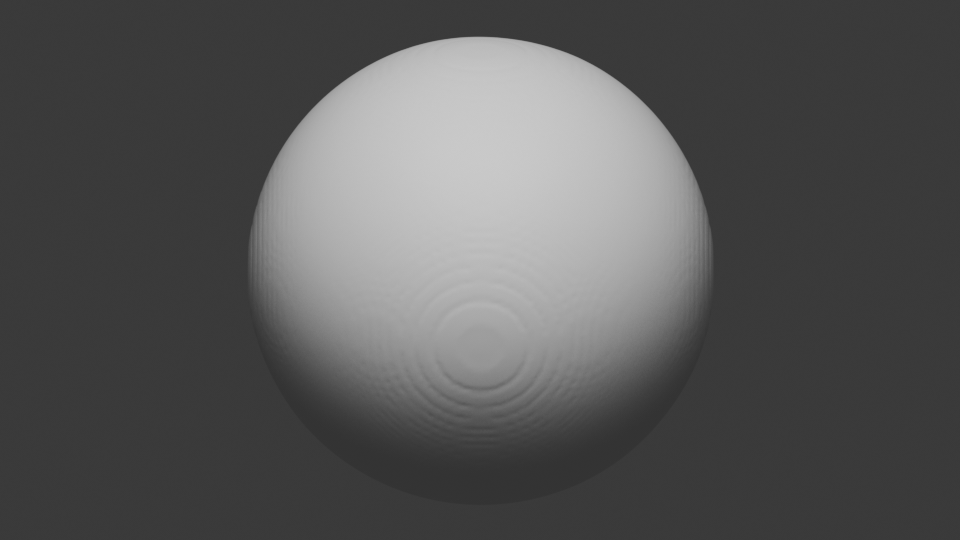
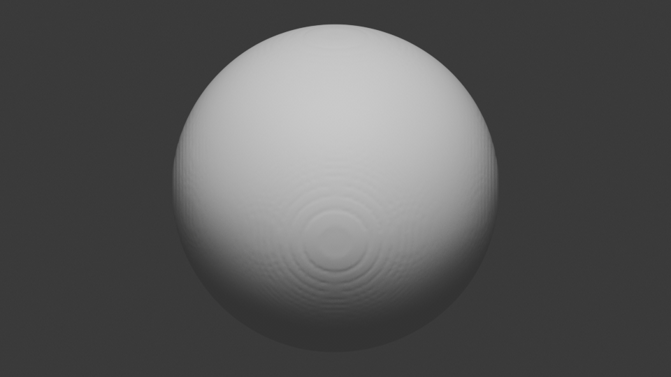
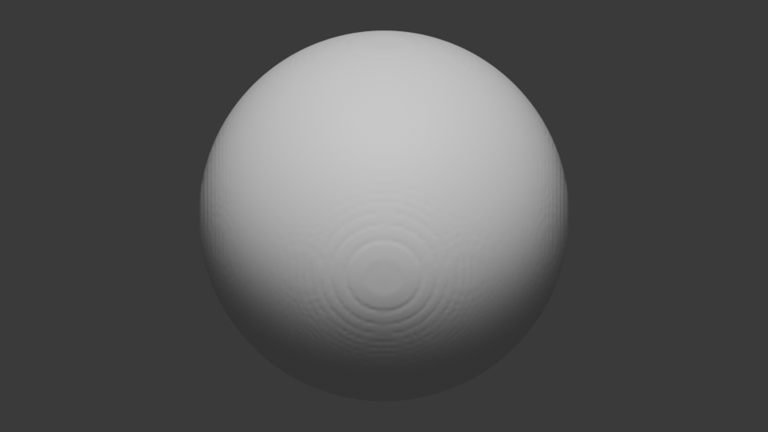
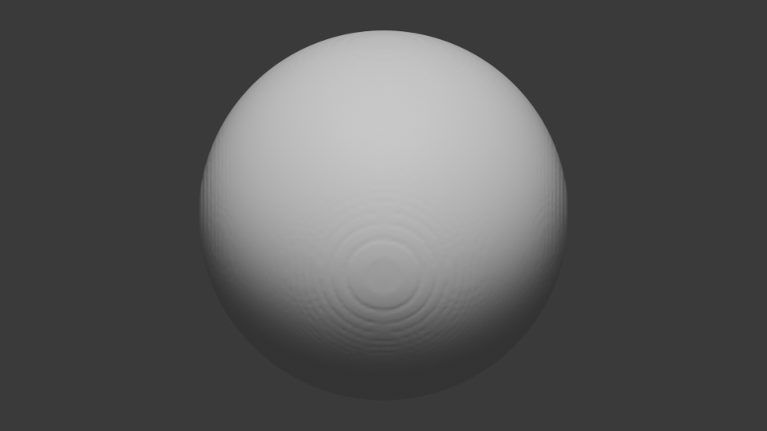
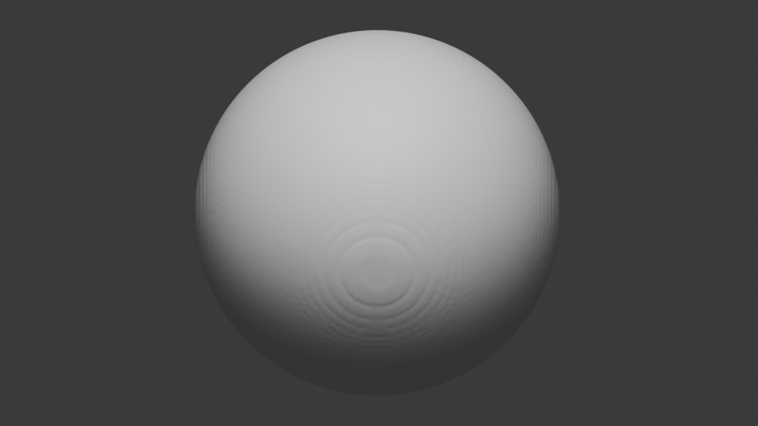

# FBMS Pipeline

This directory contains the FBMS surface inputs, generated shell assets,
tetrahedral simulation meshes, simulation case configs, and Alembic
postprocessing configs.

The main pipeline is:

```text
raw FBMS OBJ
  -> bounding sphere OBJ
  -> thicken raw FBMS + thicken sphere with SDFs
  -> union the thick shells and dump a raw marching-cubes OBJ
  -> isotropic remesh the raw union surface
  -> tetrahedralize the remeshed surface into a .veg simulation mesh
  -> run IPC simulation cases
  -> dump surface animation as .abc
```

The current production assets live under:

```text
examples/fbms/generated/r128_default/g0_b3/
examples/fbms/generated/r128_default/g0_b8/
```

## Build The Tools

From the repo root, build the command-line tools used by the pipeline:

```bash
cmake --preset base_no_mkl
cmake --build --preset base_no_mkl_release \
  --target generateFBMSUnionSurface remeshSurface tetMesher runIPCSim convertAnimation \
  -j 4
```

The commands below assume the tools are available in `build/base_no_mkl/bin/`.

## 1. Raw Mesh Inputs

The tracked raw surface inputs are:

```text
examples/fbms/g0_b3/g0_b3_fbms.obj
examples/fbms/g0_b8/g0_b8_fbms.obj
```

Each raw FBMS mesh is paired with an enclosing sphere:

```text
examples/fbms/g0_b3/g0_b3_fbms_bounding_sphere.obj
examples/fbms/g0_b8/g0_b8_fbms_bounding_sphere.obj
```

If the raw mesh changes, regenerate its sphere first. The default sphere generator
uses an AABB-center sphere with tiny relative padding, matching the current assets.

```bash
python3 scripts/generate_bounding_sphere.py \
  --input examples/fbms/g0_b8/g0_b8_fbms.obj \
  --output examples/fbms/g0_b8/g0_b8_fbms_bounding_sphere.obj \
  --bounds-method aabb \
  --method icosphere \
  --subdivisions 5 \
  --padding 1e-9
```

Use `--bounds-method minimal` if you want a smaller enclosing sphere, but keep the
existing method when reproducing the checked-in FBMS assets.

## 2. Thicken And Union The Surfaces

`generateFBMSUnionSurface` is the raw shell generation tool. It samples the raw
FBMS surface and the bounding sphere on a uniform SDF grid, turns each into a
thick shell, unions the two shell fields, and dumps the zero level set as a raw
marching-cubes OBJ.

For the current `r128_default` g0_b8 asset:

```bash
build/base_no_mkl/bin/generateFBMSUnionSurface \
  --fbms examples/fbms/g0_b8/g0_b8_fbms.obj \
  --sphere examples/fbms/g0_b8/g0_b8_fbms_bounding_sphere.obj \
  --fbms-thickness 0.025 \
  --sphere-thickness 0.025 \
  --resolution 128 \
  --padding-ratio 0.08 \
  --output-surface examples/fbms/generated/r128_default/g0_b8/union_shell_raw.obj
```

Important knobs:

- `--fbms-thickness`: shell half-width around the raw FBMS surface.
- `--sphere-thickness`: shell half-width around the enclosing sphere.
- `--resolution`: uniform SDF grid resolution per axis.
- `--padding-ratio`: extra grid domain padding after thickness expansion.
- `--output-surface`: raw union OBJ dumped from marching cubes.

## 3. Remesh The Union Surface

The raw marching-cubes OBJ is usually too grid-like for tetrahedralization. Run
CGAL isotropic remeshing before generating the simulation mesh:

```bash
build/base_no_mkl/bin/remeshSurface cgal_iso \
  --input-mesh examples/fbms/generated/r128_default/g0_b8/union_shell_raw.obj \
  --output-mesh examples/fbms/generated/r128_default/g0_b8/union_shell_remesh.obj \
  --edge-length 0.75 \
  --sharp-edge-angle 180
```

`--edge-length` is relative to the input average edge length. The current value
slightly regularizes/refines the marching-cubes surface without changing the
overall shell shape.

## 4. Generate Shell Assets With The Batch Script

For normal use, do not run the two raw/remesh commands by hand. Use
`examples/fbms/generate_shell_assets.py`, which reads `shell_assets.json` and
runs `generateFBMSUnionSurface` followed by `remeshSurface`.

Preview the current `r128_default` commands:

```bash
examples/fbms/generate_shell_assets.py \
  --job r128_default \
  --overwrite \
  --dry-run
```

Generate the assets, leaving existing outputs untouched:

```bash
examples/fbms/generate_shell_assets.py \
  --job r128_default \
  --skip-existing
```

Regenerate them from scratch:

```bash
examples/fbms/generate_shell_assets.py \
  --job r128_default \
  --overwrite
```

For each selected case, the asset script writes:

```text
generated/r128_default/g0_b8/union_shell_raw.obj
generated/r128_default/g0_b8/union_shell_remesh.obj
generated/r128_default/g0_b8/stats.json
```

`shell_assets.json` is split into shared defaults and per-job overrides. The
defaults define which cases to run, where generated files go, the output
filenames, and the raw/remesh parameters shared by all jobs:

```json
{
  "build_dir": "build/base_no_mkl",
  "defaults": {
    "cases": "all",
    "output_dir": "generated/{job}/{case}",
    "raw_filename": "union_shell_raw.obj",
    "remesh_filename": "union_shell_remesh.obj",
    "stats_filename": "stats.json",
    "raw": {
      "padding_ratio": 0.08,
      "enable_truncating": false
    },
    "remesh": {
      "edge_length": 0.75,
      "sharp_edge_angle": 180.0
    }
  }
}
```

The raw parameters map directly to `generateFBMSUnionSurface`:

- `resolution`: uniform SDF grid resolution per axis.
- `fbms_thickness`: unsigned-distance shell width for the raw FBMS surface. A
  negative value is treated as a target volume budget passed through to
  `generateFBMSUnionSurface`.
- `sphere_thickness`: unsigned-distance shell width for the bounding sphere.
- `padding_ratio`: extra SDF grid domain padding after thickness expansion.
- `enable_truncating`: when true, pass `--enable-truncating` so the FBMS shell is
  clipped to the outer surface of the thickened bounding sphere.

The remesh parameters map directly to `remeshSurface cgal_iso`:

- `edge_length`: target edge length relative to the input average edge length.
- `sharp_edge_angle`: feature angle passed to the remesher; `180.0` effectively
  avoids preserving extra sharp features for these smooth shell assets.

Each job supplies the raw parameters that are different for that asset set and
can optionally override remesh parameters. The current jobs are:

```json
[
  {
    "name": "r64_thick",
    "raw": {
      "resolution": 64,
      "fbms_thickness": 0.05,
      "sphere_thickness": 0.05
    },
    "remesh": {
      "edge_length": 1.0
    }
  },
  {
    "name": "r64_default",
    "raw": {
      "resolution": 64,
      "fbms_thickness": 0.02,
      "sphere_thickness": 0.02
    }
  },
  {
    "name": "r128_default",
    "raw": {
      "resolution": 128,
      "fbms_thickness": 0.025,
      "sphere_thickness": 0.025
    }
  },
  {
    "name": "r256_default",
    "raw": {
      "resolution": 256,
      "fbms_thickness": 0.02,
      "sphere_thickness": 0.02
    }
  }
]
```

So the effective `r128_default` parameters are:

```json
{
  "raw": {
    "resolution": 128,
    "fbms_thickness": 0.025,
    "sphere_thickness": 0.025,
    "padding_ratio": 0.08
  },
  "remesh": {
    "edge_length": 0.75,
    "sharp_edge_angle": 180.0
  }
}
```

## 5. Tetrahedralize The Remeshed Surface

The IPC simulator uses a tetrahedral `.veg` mesh. Tetrahedralization is driven by
a JSON config stored next to the generated shell assets:

```text
examples/fbms/generated/r128_default/g0_b8/tetmesh.json
```

Run:

```bash
build/base_no_mkl/bin/tetMesher \
  --config examples/fbms/generated/r128_default/g0_b8/tetmesh.json
```

The current fTetWild config has this shape:

```json
{
  "version": 1,
  "backend": "tetwild",
  "input_mesh": "union_shell_remesh.obj",
  "output_mesh": "union_shell.veg",
  "output_surface": "union_shell_tet_surface.obj",
  "print_stats": true,
  "quiet": true,
  "tetwild": {
    "lr": 0.05,
    "epsr": 0.001,
    "stop_energy": 10,
    "max_threads": 8
  }
}
```

`tetMesher` can also use the TetGen backend. That is useful as a comparison path
or when you want TetGen's `command` string control over quality/volume flags:

```json
{
  "version": 1,
  "backend": "tetgen",
  "input_mesh": "union_shell_remesh.obj",
  "output_mesh": "union_shell_tetgen.veg",
  "output_surface": "union_shell_tetgen_surface.obj",
  "print_stats": true,
  "tetgen": {
    "command": "pq1.414a0.01"
  }
}
```

Run the TetGen config the same way:

```bash
build/base_no_mkl/bin/tetMesher \
  --config examples/fbms/generated/r128_default/g0_b3/tetmesh_tetgen.json
```

Relative paths resolve from the config directory. The important outputs are:

```text
union_shell.veg
union_shell_tet_surface.obj
```

`union_shell.veg` is the simulation mesh. `union_shell_tet_surface.obj` is the
boundary extracted from the tetrahedral mesh and is useful for inspection.

## 6. Run Simulation Cases

Each simulation case is a `runIPCSim` JSON config next to the generated meshes.
The config refers to:

- `tet-mesh`: the tetrahedral simulation mesh, usually `union_shell.veg`.
- `surface-mesh`: the embedded/output surface, usually `union_shell_remesh.obj`.
- `output`: the case output folder.
- `output-von-mises`: enables per-tet stress JSON output.

Manual run example:

```bash
build/base_no_mkl/bin/runIPCSim \
  examples/fbms/generated/r128_default/g0_b8/g0_b8_case1_pressure-ipc.json \
  --log
```

Every current FBMS case runs for 300 frames and writes outputs beside the case
config:

```text
case1_pressure_output/
case2_squash_floor_prototype_output/
case3_wall_impact_floor_prototype_output/
```

Inside each output folder:

```text
states/deformXXXX.u          displacement/state sequence
surface/retXXXX.obj          deformed surface OBJ sequence
stress/von_misesXXXX.json    per-tet von Mises stress
runIPCSim.log                simulator log when --log is used
```

The three current cases are:

| Case | Config | What It Does |
| --- | --- | --- |
| `case1_pressure` | `g0_b*_case1_pressure-ipc.json` | Dynamic stable-Neo simulation with no gravity. A surface pressure force pushes inward toward `center: "auto"`, where the center is computed from the scaled surface mesh bounding box. The current configs omit `ramp-steps`, so the default is `1` and the pressure-derived external force is full strength from the first frame. |
| `case2_squash_floor_prototype` | `g0_b*_case2_squash_floor-prototype-ipc.json` | Dynamic stable-Neo prototype squeezed between two moving debug floor energies along the x axis. The lower floor moves from `x=-1.05` to `x=-0.75`, and the upper floor moves from `x=1.05` to `x=0.75` over frames `[0, 100]`. |
| `case3_wall_impact_floor_prototype` | `g0_b*_case3_wall_impact_floor-prototype-ipc.json` | Dynamic stable-Neo impact prototype. The shell starts with velocity `[50, 0, 0]` and hits an upper x-axis debug floor energy at `x=1.2`. |

Important contact limitation:

> The `floors` entries below do not use external IPC contact yet. External IPC
> contact is not implemented in this runner path. The current floors are a
> simple debug-only quadratic floor energy on embedded surface vertices,
> implemented by `EmbeddedSurfaceFloorPotentialEnergy`. This is useful for
> prototype squeezing/impact tests, but it is not the final external-contact
> model. Future work should replace these debug floors with real external IPC
> contact.

`surface-pressure-force` is used by case 1:

```json
{
  "surface-pressure-force": {
    "enabled": true,
    "center": "auto",
    "pressure": 1000000.0
  }
}
```

When enabled, this computes a per-surface-vertex force pointing from each rest
surface vertex toward `center`, weighted by vertex surface area, then projects it
to simulation DOFs. `center` can be a numeric `[x, y, z]` vector or `"auto"`.
`"auto"` uses the scaled surface rest-position bounding-box center. `pressure`
sets the force magnitude scale. `ramp-steps` is optional and defaults to `1`.
When present, it must be positive and linearly ramps the force from zero to full
strength over the first frames. `ramp-steps: 1` means full strength on frame 0.

`floors` is used by cases 2 and 3:

```json
{
  "floors": [
    {
      "axis": "x",
      "side": "lower",
      "kappa": 1000000.0,
      "motion": {
        "height-start": -1.05,
        "height-end": -0.75,
        "frame-start": 0,
        "frame-end": 100
      }
    },
    {
      "axis": "x",
      "side": "upper",
      "kappa": 1000000.0,
      "height": 1.2
    }
  ]
}
```

Each floor entry requires `axis` and `kappa`, plus exactly one of `height` or
`motion`. `axis` selects `x`, `y`, or `z`. `side: "lower"` penalizes vertices
below `height` along that axis; `side: "upper"` penalizes vertices above
`height`. `kappa` is the quadratic penalty stiffness. `height` creates a static
floor. `motion` linearly interpolates the floor height from `height-start` to
`height-end` over `[frame-start, frame-end]`, then keeps the endpoint value.

## 7. Dump Alembic Animation

`convertAnimation` turns the simulated surface OBJ sequence into Alembic. The
FBMS animation configs are named `*-anim.json`.

Example:

```bash
build/base_no_mkl/bin/convertAnimation \
  examples/fbms/generated/r128_default/g0_b8/g0_b8_case1_pressure-anim.json
```

The config uses `union_shell_remesh.obj` as the driving mesh and reads the
simulated surface sequence:

```json
{
  "output-folder": "case1_pressure_output/abc",
  "meshes": [
    {
      "name": "g0_b8_case1_pressure",
      "driving-mesh": "union_shell_remesh.obj",
      "sequence": "case1_pressure_output/surface/ret{:04d}.obj",
      "sequence-type": "objmesh",
      "sequence-range": [0, 300]
    }
  ]
}
```

`output-folder` is resolved relative to the `anim.json` directory. The `.abc`
files therefore land inside the simulation output folder:

```text
case1_pressure_output/abc/g0_b8_case1_pressure.abc
case2_squash_floor_prototype_output/abc/g0_b8_case2_squash_floor_prototype.abc
case3_wall_impact_floor_prototype_output/abc/g0_b8_case3_wall_impact_floor_prototype.abc
```

You can still pass a second CLI argument to override the JSON output folder for
one-off exports:

```bash
build/base_no_mkl/bin/convertAnimation \
  examples/fbms/generated/r128_default/g0_b8/g0_b8_case1_pressure-anim.json \
  /tmp/fbms_abc_preview
```

## 8. Run Simulation And Postprocessing With The Batch Runner

`scripts/run_sim_batch.py` is the pipeline runner. It reads
`examples/fbms/fbms_batch.json`, selects a job, then runs that job's stages in
normalized order:

```text
sim -> abc -> render
```

The job declares its stages in JSON:

```json
{
  "name": "g0_b8",
  "stages": ["sim", "abc", "render"],
  "cases": [
    "g0_b8_case1_pressure",
    "g0_b8_case2_squash_floor_prototype",
    "g0_b8_case3_wall_impact_floor_prototype"
  ]
}
```

Each case maps to the three config files used by the stages:

```json
{
  "sim_config": "examples/fbms/generated/r128_default/g0_b8/g0_b8_case1_pressure-ipc.json",
  "anim_config": "g0_b8_case1_pressure-anim.json",
  "render_config": "g0_b8_case1_pressure-render.json"
}
```

Relative `anim_config` and `render_config` paths resolve from the simulation
config directory. If a job includes `render`, every selected case must provide
the matching config path.

Preview the full g0_b8 pipeline:

```bash
scripts/run_sim_batch.py \
  --config examples/fbms/fbms_batch.json \
  --job g0_b8 \
  --dry-run
```

Run the full g0_b8 pipeline:

```bash
scripts/run_sim_batch.py \
  --config examples/fbms/fbms_batch.json \
  --job g0_b8 \
  --overwrite
```

Run only postprocessing from existing simulation output:

```bash
scripts/run_sim_batch.py \
  --config examples/fbms/fbms_batch.json \
  --job g0_b8_post
```

Regenerate only Alembic-rendered GIF previews from existing `.abc` files:

```bash
scripts/run_sim_batch.py \
  --config examples/fbms/fbms_batch.json \
  --job g0_b8_render \
  --overwrite
```

Useful runner flags:

- `--dry-run`: print commands without running them.
- `--overwrite`: allow `runIPCSim` to replace existing output folders and pass
  `--overwrite` to render postprocessing.
- `--skip-existing`: skip simulation cases whose output folder already exists.
- `--all-jobs`: run every job in the batch config.

The batch config currently provides:

```text
case1_pressure
case2_squash_floor_prototype
case3_wall_impact_floor_prototype
g0_b8
g0_b3
all_fbms
g0_b8_post
g0_b3_post
all_fbms_post
g0_b8_render
g0_b3_render
all_fbms_render
```

## 9. Render Alembic Previews With Blender

`scripts/render_abc_preview.py` is a generic wrapper for rendering an Alembic
`.abc` animation to PNG frames with Blender, then encoding those frames to a GIF
with ffmpeg. It is useful for lightweight README previews and can be run directly
or through the batch runner's `render` stage.

The script expects Blender and ffmpeg to be available. On macOS it automatically
tries `/Applications/Blender.app/Contents/MacOS/Blender`; otherwise pass
`--blender` or set `BLENDER`. Pass `--ffmpeg` or set `FFMPEG` if ffmpeg is not
on `PATH`.

Example:

```bash
scripts/render_abc_preview.py \
  --config examples/fbms/generated/r128_default/g0_b8/g0_b8_case1_pressure-render.json \
  --overwrite
```

The render config is resolved relative to the config file:

```json
{
  "abc": "case1_pressure_output/abc/g0_b8_case1_pressure.abc",
  "frames_dir": "case1_pressure_output/render_frames",
  "output_gif": "../../../fbms_video/g0b8_case1.gif",
  "frame_start": 0,
  "frame_end": 299,
  "frame_step": 3,
  "fps": 30,
  "gif_fps": 10,
  "width": 960,
  "height": 540,
  "samples": 64,
  "camera": {
    "mode": "auto",
    "view": [0.0, -1.0, 0.35],
    "ortho_scale_multiplier": 2.4
  }
}
```

`frame_step: 3` samples every third Alembic frame from the 300-frame simulation
and `gif_fps: 10` keeps the preview duration close to the original 10-second
animation. The intermediate `render_frames` folder is under the case output
directory and is treated as generated output.

## End-To-End Example

This is the usual g0_b8 workflow from regenerated shell assets through
postprocessed outputs:

```bash
# 1. Generate raw union + remeshed shell assets.
examples/fbms/generate_shell_assets.py \
  --job r128_default \
  --skip-existing

# 2. Build the tetrahedral simulation mesh.
build/base_no_mkl/bin/tetMesher \
  --config examples/fbms/generated/r128_default/g0_b8/tetmesh.json

# 3. Run all g0_b8 simulations, then dump .abc and GIF outputs.
scripts/run_sim_batch.py \
  --config examples/fbms/fbms_batch.json \
  --job g0_b8 \
  --overwrite
```

After that run, inspect:

```text
examples/fbms/generated/r128_default/g0_b8/case1_pressure_output/
examples/fbms/generated/r128_default/g0_b8/case2_squash_floor_prototype_output/
examples/fbms/generated/r128_default/g0_b8/case3_wall_impact_floor_prototype_output/
```

For DCC animation, use each `abc/*.abc` file. For quick previews, use the GIFs
under `examples/fbms/fbms_video/`. For volumetric stress visualization, use the
OpenVDB exporter pipeline.

## Result Previews

The GIFs below are lightweight previews rendered from each case's Alembic `.abc`
file with `scripts/render_abc_preview.py`. They show the two current FBMS shell
assets under the three simulation jobs described above. Use the corresponding
output folders for the full `.abc` animation exports.

### Case 1: Surface Pressure

The pressure case applies an inward surface force with no gravity.

| Asset | Simulation Run Time | Preview Render Time | Preview |
| --- | --- | --- | --- |
| `g0_b3` | `29160.31s` (8h 6m 0.31s) | `82.56s` |  |
| `g0_b8` | `53875.06s` (14h 57m 55.06s) | `89.59s` |  |

### Case 2: Squash Between Moving Floors

The squash prototype compresses the shell between two x-axis debug floor
energies.

| Asset | Simulation Run Time | Preview Render Time | Preview |
| --- | --- | --- | --- |
| `g0_b3` | `22916.38s` (6h 21m 56.38s) | `69.87s` |  |
| `g0_b8` | `42624.27s` (11h 50m 24.27s) | `86.39s` |  |

### Case 3: Wall Impact

The impact prototype gives the shell an initial x velocity and lets it collide
with an upper x-axis debug floor energy.

| Asset | Simulation Run Time | Preview Render Time | Preview |
| --- | --- | --- | --- |
| `g0_b3` | `12786.22s` (3h 33m 6.22s) | `69.12s` |  |
| `g0_b8` | `11847.24s` (3h 17m 27.24s) | `88.56s` |  |
