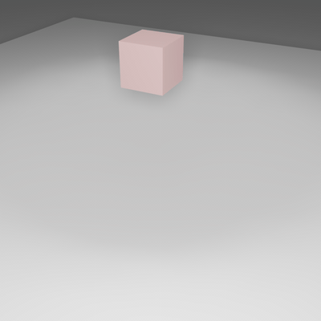
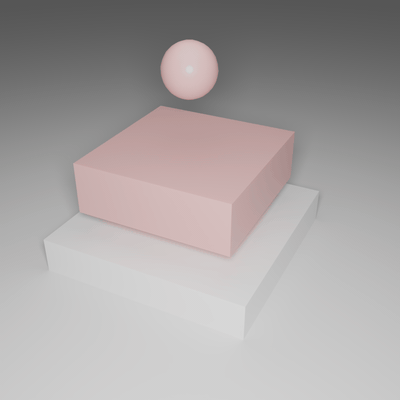
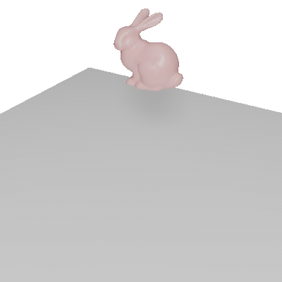

# Legacy (Non-IPC) Examples

This directory contains examples that do not use the unified IPC entry (`runIPCSim`).

These cases are preserved for compatibility and historical reference, including:

- classic `runSim` volume examples
- classic `runShellSim` shell examples
- Python wrappers `pgo_run_sim.py` and `pgo_dump_abc.py`

If you want the current recommended workflow, use `examples/ipc/` instead.

## Quick Start

Build legacy tools:

```bash
cmake --preset base_no_mkl
cmake --build build/base_no_mkl --target runSim runShellSim convertAnimation
```

Run representative legacy cases from the repo root:

```bash
build/base_no_mkl/bin/runSim examples/legacy/box/box.json
build/base_no_mkl/bin/runSim examples/legacy/dragon-dyn/dragon.json
build/base_no_mkl/bin/runShellSim examples/legacy/shell/shell.json
```

Convert dumped OBJ sequences to Alembic:

```bash
build/base_no_mkl/bin/convertAnimation examples/legacy/box/anim.json
build/base_no_mkl/bin/convertAnimation examples/legacy/shell/anim.json
```

## Showcase

<table style="width: 100%; table-layout: fixed; border-collapse: collapse;">
	<tr>
		<th style="width: 50%;text-align:center; border-top: 1px solid #ddd;">Box (NM)</th>
		<th style="width: 50%;text-align:center; border-top: 1px solid #ddd;">Box with Sphere (NM)</th>
	</tr>
	<tr>
		<td style="text-align: center; border-bottom: 1px solid #ddd;"></td>
		<td style="text-align: center; border-bottom: 1px solid #ddd;"></td>
	</tr>
	<tr>
		<th style="width: 50%;text-align:center;">Dragon (BE)</th>
		<th style="width: 50%;text-align:center;">Bunny (BE)</th>
	</tr>
	<tr>
		<td style="text-align: center; border-bottom: 1px solid #ddd;"></td>
		<td style="text-align: center; border-bottom: 1px solid #ddd;"></td>
	</tr>
	<tr>
		<th style="width: 50%;text-align:center;">Rest Dragon</th>
		<th style="width: 50%;text-align:center;">Deformed Dragon</th>
	</tr>
	<tr>
		<td style="text-align: center; border-bottom: 1px solid #ddd;"></td>
		<td style="text-align: center; border-bottom: 1px solid #ddd;"></td>
	</tr>
</table>

## Python Wrappers (Legacy)

These wrappers still work, but now point to paths under `examples/legacy/`.

Run simulation from Python:

```bash
python src/python/pypgo/pgo_run_sim.py examples/legacy/box/box.json
python src/python/pypgo/pgo_run_sim.py examples/legacy/box-with-sphere/box-with-sphere.json
python src/python/pypgo/pgo_run_sim.py examples/legacy/dragon-dyn/dragon.json
```

Dump Alembic from animation config:

```bash
python src/python/pypgo/pgo_dump_abc.py examples/legacy/box/anim.json examples/legacy/box/
```

Equivalent CLI conversion:

```bash
build/base_no_mkl/bin/convertAnimation examples/legacy/box/anim.json
```

If the optional output path is omitted, `convertAnimation` writes `.abc` files next to `anim.json` and uses each mesh `name` field as the filename stem.

## Directory Notes

Top-level legacy cases currently include:

- `examples/legacy/box/`
- `examples/legacy/box-hang/`
- `examples/legacy/box-squash/`
- `examples/legacy/box-with-sphere/`
- `examples/legacy/bunny/`
- `examples/legacy/dragon/`
- `examples/legacy/dragon-dyn/`
- `examples/legacy/shell/`
- `examples/legacy/cubic/`

For detailed cubic legacy documentation, see [`examples/legacy/cubic/README.md`](./cubic/README.md).
