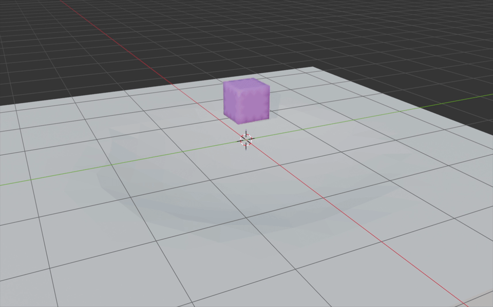
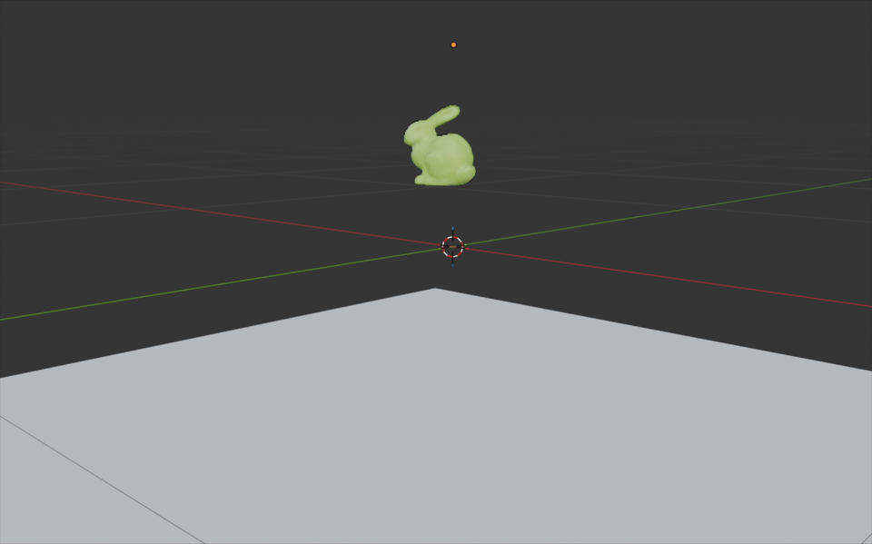
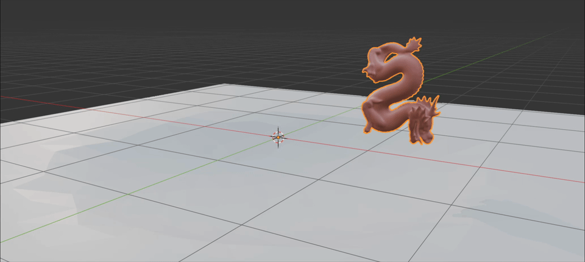
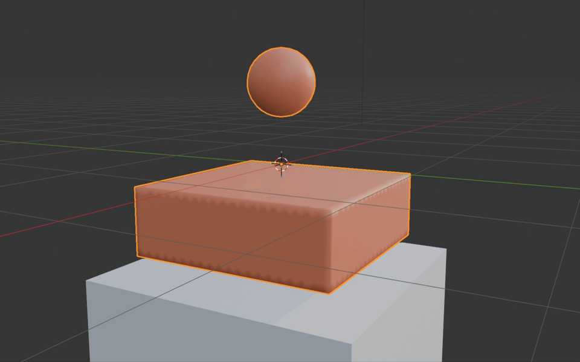
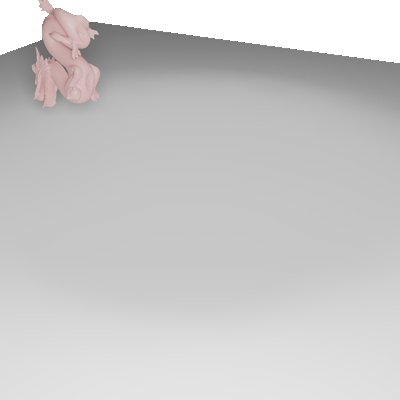

# Legacy (Non-IPC) Examples

This directory contains examples that do not use the unified IPC entry (`runIPCSim`).

These cases are preserved for compatibility and historical reference, organized by solver/layout:

- `cubic/`: classic `runSim` cubic volume examples
- `tet/`: classic `runSim` tetrahedral examples
- `shell/`: classic `runShellSim` shell examples
- Python wrappers `pgo_run_sim.py` and `pgo_dump_abc.py`

If you want the current recommended workflow, use `examples/ipc/` instead.

## Quick Start

Build legacy tools with presets:

```bash
cmake --preset base_no_mkl
cmake --build --preset base_no_mkl_release --target runSim runShellSim convertAnimation
```

Run representative legacy cases from the repo root:

```bash
build/base_no_mkl/bin/runSim examples/legacy/cubic/box/box.json
build/base_no_mkl/bin/runSim examples/legacy/tet/box-hang/box.json
build/base_no_mkl/bin/runShellSim examples/legacy/shell/shell.json
```

Convert dumped OBJ sequences to Alembic:

```bash
build/base_no_mkl/bin/convertAnimation examples/legacy/cubic/box/anim.json
build/base_no_mkl/bin/convertAnimation examples/legacy/cubic/box-with-sphere-xlite/anim-xlite.json
build/base_no_mkl/bin/convertAnimation examples/legacy/tet/box/anim.json
build/base_no_mkl/bin/convertAnimation examples/legacy/shell/anim.json
```

Tet cases with committed animation configs are currently `tet/box/`, `tet/box-hang/`, and `tet/box-squash/`.
`tet/box-with-sphere/`, `tet/bunny/`, `tet/dragon/`, and `tet/dragon-dyn/` are run-only in this directory.

## Showcase

| Cubic: Box | Cubic: Bunny |
| --- | --- |
|  |  |

| Cubic: Dragon | Cubic: Box with Sphere (xlite preview) |
| --- | --- |
|  |  |

| Tet: Box | Tet: Box with Sphere |
| --- | --- |
|  |  |

| Tet: Bunny | Tet: Dragon (dynamic) |
| --- | --- |
|  |  |

| Tet: Dragon rest shape | Tet: Dragon deformed shape |
| --- | --- |
|  |  |

## Python Wrappers (Legacy)

These wrappers still work and point to the current `examples/legacy/` layout.

Run simulation from Python:

```bash
python src/python/pypgo/pgo_run_sim.py examples/legacy/cubic/box/box.json
python src/python/pypgo/pgo_run_sim.py examples/legacy/tet/box/box.json
```

Dump Alembic from animation config:

```bash
python src/python/pypgo/pgo_dump_abc.py examples/legacy/cubic/box/anim.json examples/legacy/cubic/box/box.abc
python src/python/pypgo/pgo_dump_abc.py examples/legacy/tet/box/anim.json examples/legacy/tet/box/box.abc
```

Equivalent CLI conversion:

```bash
build/base_no_mkl/bin/convertAnimation examples/legacy/cubic/box/anim.json
build/base_no_mkl/bin/convertAnimation examples/legacy/tet/box/anim.json
```

If the optional output path is omitted, `convertAnimation` writes `.abc` files next to `anim.json` and uses each mesh `name` field as the filename stem.

## Directory Notes

Directory responsibilities:

- `examples/legacy/cubic/`: cubic volume `runSim` cases and committed preview media (`cubic/media/`)
- `examples/legacy/tet/`: tetrahedral `runSim` cases, including additional preview assets
- `examples/legacy/shell/`: shell `runShellSim` case plus shell animation config

For detailed cubic-only case notes (mesh assets, per-case commands, and mesher regeneration commands), see [`examples/legacy/cubic/README.md`](./cubic/README.md).
Tet and shell entry commands remain in this parent README.
